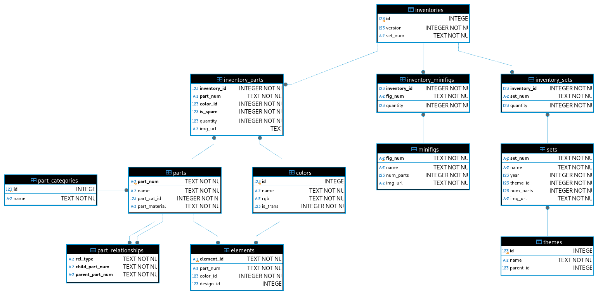

# rbk-db

Import the [Rebrickable LEGO database](https://rebrickable.com/downloads/) into SQLite.

```shell
rbk-db dump
sqlite3 rebrickable.db
```

## General organization



The complete database schema is available [here](./src/database/migrations/V01__init.sql).

An *inventory* represents either:
* A specific version of a LEGO set, which includes:
  - A list of subsets (table `inventory_sets`);
  - A list of parts, excluding parts of subsets and minifigures (table `inventory_parts`);
  - A list of minifigures (table `inventory_minifigs`);
* A minifigure, which includes:
  - A list of parts (table `inventory_parts`).

Therefore, `inventories.set_num` serves as a foreign key to either `sets.set_num` or `minifigs.fig_num`, depending on the inventory type.
In the case of minifigures, `inventories.set_num` is prefixed with `fig-` and `version` is always `1`.
